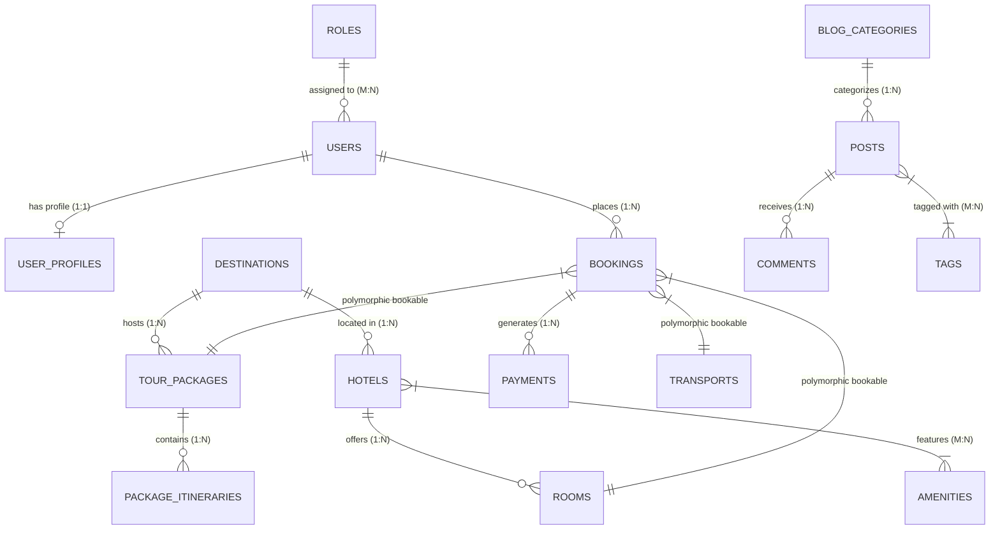

# 🇦🇪 UAE Tourism — Luxury Travel & Destination Platform

[](https://laravel.com)
[](https://php.net)
[](https://tailwindcss.com)
[](https://vitejs.dev)
[](https://mysql.com)
[](LICENSE)

An enterprise-grade, luxury tourism and travel management web portal built for the United Arab Emirates. The platform features an ultra-premium glassmorphic user interface, multilingual dynamic localization (English, Arabic, Russian with full RTL support), role-based access control (RBAC), end-to-end tour & hotel booking management, and a dynamic database-driven administration portal.

---

## 🎨 UI & Design System

The application is meticulously crafted to evoke the elegance and modern luxury associated with UAE hospitality. It utilizes a custom Tailwind CSS 4 theme with custom CSS variables, glassmorphic visual layers, micro-animations, and fluid responsive layouts.

### 🖌️ Color Palette

| Token Name | Hex Code | Visual Preview | Usage Description |
| :--- | :--- | :--- | :--- |
| **Gold** (`--color-gold`) | `#D4AF37` | `■` `#D4AF37` | **Primary Luxury Accent**: Brand logos, active menu highlights, action buttons, rating stars, glowing borders, custom scrollbar thumb. |
| **Deep Black** (`--color-deepblack`) | `#111111` | `■` `#111111` | **High-Contrast Dark Canvas**: Admin sidebar, dark hero sections, footer background, primary body text in light mode, scrollbar track. |
| **Off White** (`--color-offwhite`) | `#F9F9F9` | `■` `#F9F9F9` | **Light Background**: Main content canvas, card surfaces, section backgrounds for high legibility. |
| **Glass Light** (`.glass`) | `rgba(255, 255, 255, 0.2)` | `■` `Blur 12px` | **Header & Card Layer**: Light frosted glass with `backdrop-filter: blur(12px)` and subtle white border. |
| **Glass Dark** (`.glass-dark`) | `rgba(0, 0, 0, 0.4)` | `■` `Blur 12px` | **Overlay Navigation Layer**: Dark frosted glass for floating hero controls, admin headers, and dark cards. |
| **Emerald Success** | `#10B981` | `■` `#10B981` | **Approved & Paid Status**: Approved bookings, completed payments, success toast notifications. |
| **Amber Warning** | `#F59E0B` | `■` `#F59E0B` | **Pending Status**: Pending booking requests, moderate moderation states, warning alerts. |
| **Rose Danger** | `#F43F5E` | `■` `#F43F5E` | **Cancelled & Rejected**: Rejected bookings, error notifications, delete confirmations. |

```css
/* Color Palette & Design System Tokens in resources/css/app.css */
@theme {
  --color-gold: #D4AF37;
  --color-deepblack: #111111;
  --color-offwhite: #F9F9F9;
  --font-sans: "Inter", sans-serif;
  --font-arabic: "Cairo", sans-serif;
}
```

---

### 🔤 Typography & Font Hierarchy

The platform automatically adjusts typography and font rendering based on text direction and language context:

* **LTR Mode (English & Russian)**: Uses **Inter** (weights: 300, 400, 500, 600, 700) for clean modern geometric sans-serif typography.
* **RTL Mode (Arabic)**: Dynamically switches body and heading fonts to **Cairo** (weights: 400, 600, 700) to ensure pristine Arabic typography and line height.

---

### ✨ Visual Effects & Components

1. **Glassmorphism Layers**: Modern blur layers applied using `.glass` and `.glass-dark` utilities with backdrop filters (`backdrop-blur-md`).
2. **Custom Scrollbar**: Custom WebKit scrollbar with a sleek `#111111` track and an elegant `#D4AF37` gold thumb.
3. **Animations**: Integrated **AOS (Animate On Scroll 2.3.1)** for scroll-triggered entry effects on destination grids and package cards.
4. **Touch Carousels**: **Swiper 11** responsive carousels for tour packages and testimonial showcases.
5. **Text Shadows**: Custom `.text-shadow` utilities to enhance text contrast over dynamic high-resolution destination image banners.

---

## 🌐 Multilingual & i18n Architecture

The platform supports full server-side internationalization across **English**, **Arabic**, and **Russian**:

* **Locale-Prefixed URLs**: Public frontend routes are structured with language prefixes (`/en/...`, `/ar/...`, `/ru/...`).
* **Dynamic RTL Layout**: When visiting `/ar`, the application automatically injects `dir="rtl"` into the `<html>` element, adjusting grid order, margins, paddings, and alignment seamlessly.
* **Middleware Persistence**: The `SetLocale` middleware manages session persistence and browser language negotiation (`Accept-Language`).

| Language Code | Native Name | Direction | Sample URL |
| :--- | :--- | :--- | :--- |
| `en` | English | LTR | `https://uaetourism.test/en/packages` |
| `ar` | العربية | **RTL** | `https://uaetourism.test/ar/packages` |
| `ru` | Русский | LTR | `https://uaetourism.test/ru/packages` |

---

## 👥 User Roles & Access Control (RBAC)

Built using `spatie/laravel-permission`, the application enforces granular permission checking across 40+ granular actions (`destinations.create`, `bookings.manage`, `reports.view`, etc.).

### 🛡️ Role Matrix & Test Credentials

All test accounts use their respective **email address as the password** (`password = email`):

| Role Name | Demo Email | Access Scope & Responsibilities |
| :--- | :--- | :--- |
| **Super Admin** | `superadmin@uaetourism.test` | **Full Unrestricted System Access**: Granted full permissions across all modules, system configuration, role assignments, DB menu management, and settings via `Gate::before`. |
| **Admin** | `admin@uaetourism.test` | **Full Operations Access**: Manages all business content (Destinations, Tours, Hotels, Transport, Bookings, Users, Reports, Content) excluding structural Role & Menu management. |
| **Tour Manager** | `tours@uaetourism.test` | **Catalog Management**: Creation and editing of Destinations, Tour Packages, Itineraries, Hotels, Rooms, Transports, and Media Albums. |
| **Booking Manager** | `bookings@uaetourism.test` | **Reservation & Customer Support**: Monitors customer bookings, updates booking status (Approve/Reject/Cancel), handles contact inquiries, and views financial reports. |
| **Customer** | `customer@uaetourism.test` | **Public Visitor & Travel Client**: Browses catalogs, places package & hotel reservations, accesses personal customer dashboard, leaves testimonials, and comments on blog posts. |

---

## 📦 System Modules & Architecture

### 1. 🏰 Destinations Module
* Multi-city database (Dubai, Abu Dhabi, Sharjah, Ras Al Khaimah, Fujairah, Ajman, Umm Al Quwain).
* Geolocation mapping with latitude (`map_lat`) and longitude (`map_lng`) coordinates.
* Spatie Media Library integration supporting `featured` hero images and multi-photo `gallery` collections.

### 2. 🧳 Tour Packages & Itineraries
* Flexible tour package builder with pricing, sale discounts, duration (days/nights), and guest limits.
* Per-day itinerary creator (`package_itineraries` table) allowing detailed day-by-day activity outlines.
* Translatable Included / Excluded service bullet lists stored cleanly as JSON payloads.

### 3. 🏨 Hotels & Room Inventory
* Luxury hotel directory with star ratings (1 to 5 stars) and full address mapping.
* Dynamic room type management (Deluxe Suites, Penthouse, Ocean View) with capacity and per-night pricing.
* Many-to-many Amenity mapping (Infinity Pool, Spa, Private Beach, Airport Shuttle, Wi-Fi, Butler Service).

### 4. 🚘 Transport Fleet Management
* Multimodal transport catalog: Fleet Luxury Vehicles, Executive Vans, Passenger Buses, Private Yachts, and Helicopter/Flight Pickups.
* Capacity specifications, hourly/daily pricing models, and direct transport reservation links.

### 5. 💳 Booking Engine & Financial Lifecycle
* Unique auto-generated booking numbers (`BK-YYYYMMDD-XXXX`).
* Support for multiple booking types via polymorphic relationships (`TourPackage`, `Room`, `Transport`).
* Automated booking status lifecycle:
  `Pending` ➔ `Approved` / `Rejected` ➔ `Completed` or `Cancelled`.
* Integrated payment tracking (`payments` table) supporting Pay Later and Online payments.

### 6. 🖼️ Media, Blog & Customer Content
* **Media Albums**: Multi-image photo albums and embedded video galleries (YouTube/Vimeo).
* **Testimonials**: Customer review submissions with star ratings and administrative approval moderation flow.
* **Blog & Articles**: Multi-category travel magazine with tagged articles, SEO meta titles/descriptions, and threaded user comments.

### 7. ⚙️ Dynamic Admin Sidebar & Settings
* **DB-Driven Sidebar Navigation**: Dynamic menu system rendered from the `admin_menus` table and filtered automatically based on the signed-in user's assigned permissions.
* **Global Site Settings**: Key-value settings repository for site identity, logos, contact telephone numbers, social media links, and default SEO parameters.

---

## 🗄️ Database Architecture & Entity Schema



---

## 🚀 Installation & Local Development Setup

Follow these instructions to configure and run the project on your local machine.

### Prerequisites
* **PHP**: `>= 8.2` (PHP 8.4 recommended) with `pdo_mysql`, `gd`, `mbstring`, `openssl`, `xml` extensions enabled.
* **Composer**: `>= 2.x`
* **Node.js**: `>= 18.x` & **npm**
* **Database**: MySQL `>= 8.0` / MariaDB `>= 10.4`

### Setup Instructions

1. **Clone the Repository**:
   ```bash
   git clone https://github.com/EngrMuhammad-jawad/tourism.git
   cd tourism
   ```

2. **Install PHP Dependencies**:
   ```bash
   composer install
   ```

3. **Install Frontend Node Dependencies**:
   ```bash
   npm install
   ```

4. **Configure Environment Variables**:
   Copy the example environment configuration file:
   ```bash
   cp .env.example .env
   ```
   Update your `.env` file with your database credentials:
   ```env
   APP_NAME="UAE Tourism"
   APP_ENV=local
   APP_KEY=
   APP_URL=http://127.0.0.1:8000

   DB_CONNECTION=mysql
   DB_HOST=127.0.0.1
   DB_PORT=3306
   DB_DATABASE=uae_tourism
   DB_USERNAME=root
   DB_PASSWORD=
   ```

5. **Generate Application Key**:
   ```bash
   php artisan key:generate
   ```

6. **Run Database Migrations & Seeders**:
   Execute migrations along with seeders to populate initial roles, admin menus, default settings, and demo accounts:
   ```bash
   php artisan migrate:fresh --seed
   ```

7. **Compile Frontend Assets**:
   For active development with hot-module replacement (HMR):
   ```bash
   npm run dev
   ```
   Or create a production build:
   ```bash
   npm run build
   ```

8. **Start the Laravel Development Server**:
   ```bash
   php artisan serve
   ```
   Access the application at `http://127.0.0.1:8000`.

---

## 📁 Key Project Directory Structure

```
tourism/
├── app/
│   ├── Http/
│   │   ├── Controllers/
│   │   │   ├── Admin/         # Admin Dashboard & Resource Controllers
│   │   │   └── Frontend/      # Public Frontend, Booking & Catalog Controllers
│   │   └── Middleware/        # SetLocale & AdminAccess Middleware
│   ├── Models/                # Eloquent Entity Models
│   └── Providers/             # AppServiceProvider (Gate::before Super Admin rule)
├── config/
│   ├── localization.php       # Locales (en, ar, ru) & RTL configuration
│   ├── permission.php         # Spatie Permission RBAC configuration
│   └── media-library.php      # Spatie Media Library configuration
├── database/
│   ├── migrations/            # DB Schema definitions
│   └── seeders/               # Roles, Admin Users, Menus & Demo Content Seeders
├── docs/
│   └── MIGRATION_PLAN.md      # System migration & architectural specification
├── resources/
│   ├── css/
│   │   └── app.css            # Tailwind CSS 4 theme setup & custom styling rules
│   ├── js/
│   │   └── app.js             # Vite JS bundle & script entry points
│   └── views/
│       ├── admin/             # Dynamic Admin Portal module views
│       ├── components/        # Blade UI components & SVG icons
│       ├── frontend/          # Public luxury frontend views
│       ├── layouts/           # Master app & admin layouts
│       └── partials/          # Navbar, Footer & Admin Sidebar partials
├── routes/
│   ├── web.php                # Localized frontend routes (/en, /ar, /ru)
│   ├── admin.php              # Secure administration routes (/admin)
│   └── auth.php               # Authentication routes
└── vite.config.js             # Vite build pipeline with Tailwind CSS plugin
```

---

## 📜 License

This project is open-source software licensed under the [MIT License](LICENSE).

